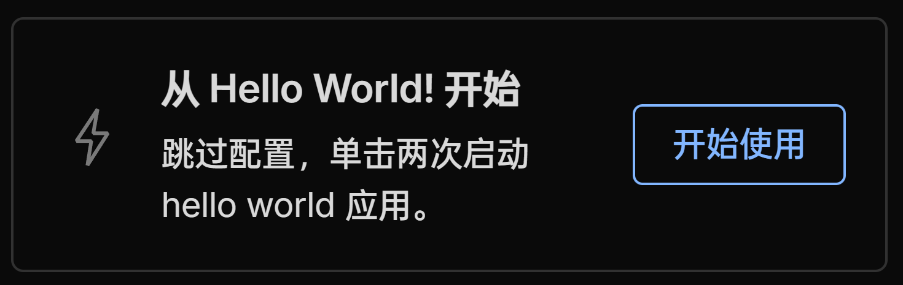
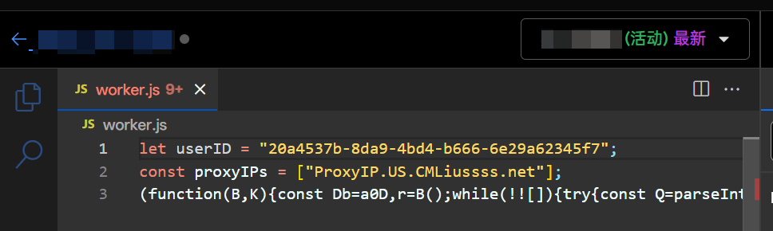

# 前言

:::caution[警告]
1. 本文章仅供学习交流，请在当地法律允许的情况下使用。
2. Cloudflare 已在其 [Self-Serve Subscription Agreement | Cloudflare](https://www.cloudflare.com/terms/) 中规定：
```txt
(j) use the Services to provide a virtual private network or other similar proxy services.
--- Google Translate:
(j) 使用服务提供虚拟专用网络或其他类似的代理服务。
```
:::

:::tip[提示]
[CMLiu/EdgeTunnel](https://github.com/cmliu/edgetunnel) 依然可用，只需使用未混淆的 `_worker.js` 文件作为 Worker 运行文件即可，无 1101。本教程使用勇哥的 Worker 代码作为演示。
:::

# 需求
1. 一个域名（免费/付费）
2. 一个 [Cloudflare](https://dash.cloudflare.com) 账号

# 关于域名
**付费的 `.xyz` `.top` 或 `.com` 等域名即可。必须要托管至 Cloudflare。**  
`dpdns.org` 域名获取方式参见：[注册 dpdns.org - Google 搜索](https://www.google.com/search?q=%E6%B3%A8%E5%86%8C+dpdns.org&oq=%E6%B3%A8%E5%86%8C+dpdns.org)
# 搭建节点
:::important[重要]
这里介绍 Vless 版节点搭建。  
Vless 版的节点和 Trojan 版的节点部署方法类似，只是换了一个 `_worker.js` 文件。需要使用 Trojan 版的可以去勇哥仓库 https://github.com/yonggekkk/Cloudflare-vless-trojan/tree/main/Trojan_workers_pages 找到 Trojan 版 Worker 代码。
:::

## 创建 Worker
打开 [Cloudflare Dashboard](https://dash.cloudflare.com)，点击右下角的 **计算 (Workers)**，在新的页面点击 **创建应用程序**。 

选择 **从 Hello World! 开始** 右边的 **开始使用** 按钮：

随便取一个 Worker 名字，但是最好不要包括下面的关键词，否则可能会报错 1101。**一般以默认分配的名称作为 Worker 名称即可**：
- vpn
- vless
- trojan
- edgetunnel
- bpb
- proxy

点击 **部署** 按钮。

## 编辑 Worker
访问 https://raw.githubusercontent.com/yonggekkk/Cloudflare-vless-trojan/refs/heads/main/Vless_workers_pages/_worker%E6%B7%B7%E6%B7%86.js 并复制整个内容。

返回 Cloudflare Dashboard，点击刚刚创建的 Worker，在控制面板中点击 **编辑代码**： 

把从上面链接复制来的内容粘贴到 Worker 代码编辑器中。

访问 [Online UUID Generator Tool](https://www.uuidgenerator.net/version4)，点击 **Copy** 按钮，把你的 UUID v4 复制下来。

---

```javascript title="原本部分 worker.js"
let userID = "86c50e3a-5b87-49dd-bd20-03c7f2735e40"; //可以把86c50e3a-5b87-49dd-bd20-03c7f2735e40改为你自定义的uuid
const proxyIPs = [""]; //""之间填写proxyip，留空将无法访问CF网站
```

把这个代码中的 `86c50e3a-5b87-49dd-bd20-03c7f2735e40` 替换为你的 UUID  
`proxyIPs` 可从 https://t.me/CMLiussss_channel/84 中随便选一个使用。推荐使用 `ProxyIP.US.CMLiussss.net`。

配置完成后大概类似于这样
```javascript title="worker.js"
let userID = "20a4537b-8da9-4bd4-b666-6e29a62345f7";    
const proxyIPs = ["ProxyIP.US.CMLiussss.net"];
```


确认无误后就点击右上角 **部署** 按钮部署你的 Worker 代码。  
显示 **版本已保存** 说明部署成功。

关于 **域和路由-自定义域** 绑定自定义域名，这里不赘述了。

## 访问 Worker
如果是自定义域名，使用 `https://自定义域名/你的UUID` 访问你的 Worker。  
如果未绑定域名，点击 Worker Dashboard 的 **访问** 按钮后在地址栏加入 `/你的UUID` 回车进入后台。  
在后台可以查看节点地址。

如果你使用 V2rayN，可点击 **点击复制链接**，然后 Ctrl+V 粘贴到 V2rayN 中。  
为了追求速度、延迟、IP地区，可以使用优选后的 Cloudflare Anycast IP 地址。具体方法就是将 **地址 (address)** 一行从 `www.visa.sg` 改为 `cf.090227.xyz`。这样IP的地区就会为**新加坡**或**日本**，而且真连接延迟会降低： 


# 编写 Clash 规则
:::tip[提示]
编写 Clash YAML 配置文件，应用分流规则。**使用 V2rayN 代理工具的可以跳过了。**
:::

如果你要使用优选IP，如 `cf.090227.xyz`，需要先编辑一下 vless 链接：
```txt title="原版"
vless://20a4537b-8da9-4bd4-b666-6e29a62345f7@www.visa.com.sg:8443?encryption=none&security=tls&type=ws&host=xxx.dpdns.org&sni=xxx.dpdns.org&fp=random&path=%2F%3Fed%3D2560#xxx.dpdns.org
```
改为
```txt title="优选"
vless://20a4537b-8da9-4bd4-b666-6e29a62345f7@cf.090227.xyz:8443?encryption=none&security=tls&type=ws&host=xxx.dpdns.org&sni=xxx.dpdns.org&fp=random&path=%2F%3Fed%3D2560#xxx.dpdns.org
```

然后访问 https://sub.cmliussss.com 填上你的 Vless 单链接（如果优选请填改后的 Vless 单链接），然后点击 **生成订阅链接**。之后导入生成好的链接进 Clash Verge 等客户端使用即可。

如果你需要防止 DNS 泄露，这里有一些资料，但不保证一定能用：  
- [【究极体！】真正防止 DNS 泄露的 Clash 小白式完美配置文件，安全+自由+流畅！ - 开发调优, Lv1 - LINUX DO](https://linux.do/t/topic/155075)
- [【进阶•DNS代理篇】最完美的DNS解决方案？通过代理DNS请求获取正确的ip，杜绝DNS泄露和DNS污染，解决透明代理下fake-ip存在的问题，开启sniffing流量嗅探亦可解决污染问题 - YouTube](https://www.youtube.com/watch?v=50iVDmqzDW8)
- [【进阶•DNS泄漏篇】竟能提速降延迟！再也不用担心DNS污染了！90%以上的人都存在DNS泄露！会有什么安全问题？如何解决代理中的DNS泄漏问题？以及WebRTC绕过代理泄漏本机真实IP，看完就知道了 - YouTube](https://www.youtube.com/watch?v=fqREM6b25SY)

通过自己更改的防泄漏 DNS 配置，如果不是部署在直链环境下，就不要通过链接更新了，防止你的订阅链接将你更改的配置文件覆盖。推荐把更改后的配置文件上传到 Cloudflare R2 存储桶，然后获得一个公开的直链给 Clash 用。