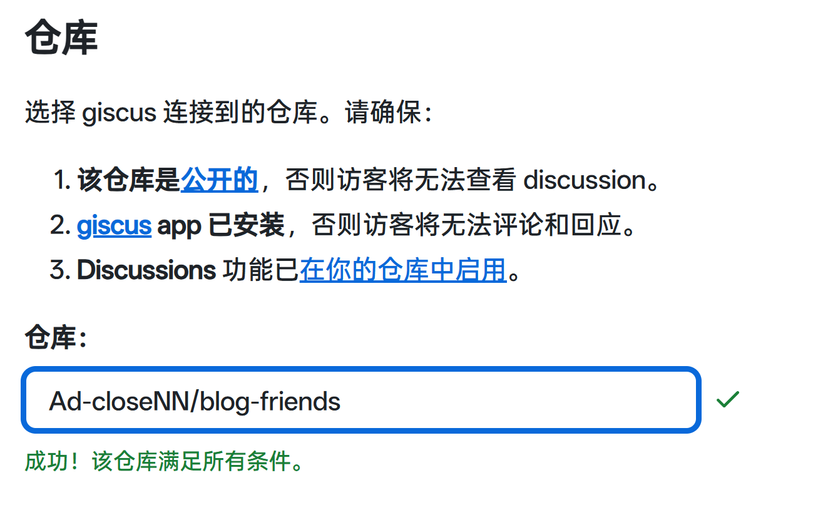
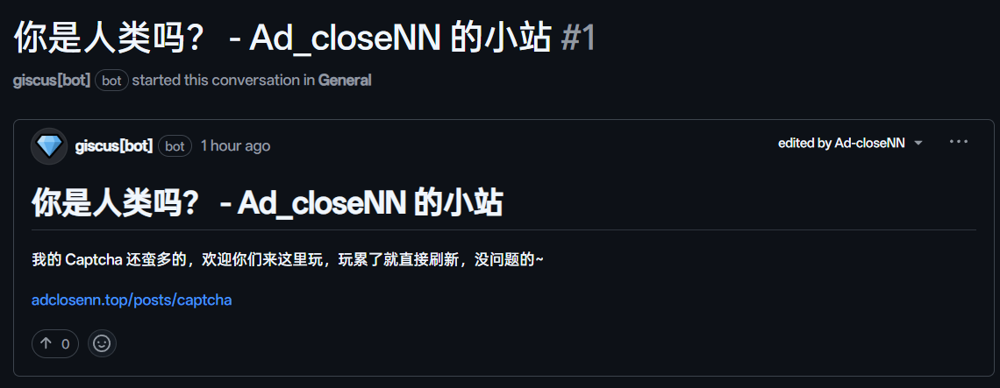

# 前言
如果你的静态博客没有评论区，又不想自己搭建一个评论系统，那么 Giscus 就是一个不错的选择。  
接下来就手把手教你添加这个[插](https://giscus.app/client.js)件并配置它。

:::warning[注意]
接下来的教程将以 Astro 网站为例子。由于 Giscus 使用 JavaScript 脚本，所以大多数博客网站都能顺利接入。  
如果你用的博客是 [Astro](https://astro.build) 或以它为架构的 [Fuwari](https://github.com/saicaca/fuwari)，那么这篇文章或许 99% 适合。
:::

# 需求
1. 一个 [GitHub](https://github.com) 账号。

# 配置 Giscus
## 在博客仓库存放评论
:::warning[注意]
如果你博客是**开源的**（选择这种方法**必须**要开源！如果**不想开源**可以选择存放评论于 [#在专用仓库存放评论](#在专用仓库存放评论) ），那么我更推荐你直接跟下面这个步骤配置使用前的安装，这么做是为了**更好地集中管理关于博客的东西**。  
当然，如果你想分开来存放，把**博客源代码**和**评论区的内容**分开，那么请选择使用第二种方法，然后这里的内容可以不用看了，可以前往 [#在专用仓库存放评论](#在专用仓库存放评论) 查看对应的方法。
:::

1. 打开 GitHub 上你博客的仓库地址，点击顶部 **Settings**（设置），拉到 **Features**（功能），选择 **Discussions** 前面的小方格，点击一下，打开 Discussions 功能。等到出现一个小勾即代表开启了 Discussions 讨论功能。 
2. 点击打开 https://github.com/apps/giscus ，选择带色按钮 Install ，将其安装在你的 GitHub 个人账户中（如果你博客仓库在别的组织，请选择安装到**组织**）。
3. 安装完毕，可以跳到 [#获取专用代码](#获取专用代码) 查看需要插入的 JS 代码了。

## 在专用仓库存放评论
:::tip[提示]
这是个通用的方法，你依然可以将其设置为你博客评论存放的仓库，即使你的博客是开源的；但是如果你的博客不开源，那么请务必使用这个方法。  
注意：使用这种方法并不能**更好地集中管理关于博客的东西**，但是能防止某些脑残人物的评论污染了你的主仓库。
:::

1. 打开 https://github.com/new ，创建一个新的仓库。
2. 在新仓库内，点击顶部 **Settings**（设置），拉到 **Features**（功能），选择 **Discussions** 前面的小方格，点击一下，打开 Discussions 功能。等到出现一个小勾即代表开启了 Discussions 讨论功能。 
3. 点击打开 https://github.com/apps/giscus ，选择带色按钮 Install ，将其安装在你的 GitHub 个人账户中（如果你博客仓库在别的组织，请选择安装到**组织**）。
4. 安装完毕。

## 获取专用代码
打开 https://giscus.app/zh-CN ，在其页面进行必要的配置：
- 语言：如果你的博客不搞 i18n 国际化，那我推荐选择 **简体中文**（博客使用的语言）。反之推荐选择 **English**。
- 仓库：如果你选择上面第一种方案（在博客仓库内），那么就填写**你博客仓库地址**（以 `用户名/仓库名` 形式填写，填你自己的。比如 `Ad-closeNN/blog-fuwari`）。如果是新的专用仓库，那么就填写**新的专用仓库地址**，格式同理。成功了为如图所示： 
- 页面 ↔️ discussion 映射关系：这个有说法。如果你博客没有很多重复标题的页面，**且不更换文章标题**，推荐选择 **Discussion 的标题包含页面的 `<title>`**，这将会以 `页面标题 -或/或其他分隔符 网站名` 为 title 开一个新讨论。如：  其他如 `pathname`，将会把 `/post/xxx` 显示出来。但是显示效果（特别是中文路径）可能没那么好？  
参考&图片原出处： https://www.2x.nz/posts/you-is-me-huh/   
- Discussion 分类：推荐选择 **General**。如果你只想让访客在博客发布评论，就选择 **Announcements**。这样即使在
- 特性：推荐启用 `启用主帖子上的反应（reaction）` `将评论框放在评论上方` `懒加载评论`。
- 其他无关紧要的请自行配置。

配置完成后，将会获得一串**独特的** JavaScript 代码（例如下面的）。将其复制下来：
```js
<script src="https://giscus.app/client.js"
        data-repo="Ad-closeNN/blog-friends"
        data-repo-id="R_kgDOPb5ZJw"
        data-category="Announcements"
        data-category-id="DIC_kwDOPb5ZJ84CuPmR"
        data-mapping="title"
        data-strict="0"
        data-reactions-enabled="1"
        data-emit-metadata="0"
        data-input-position="top"
        data-theme="preferred_color_scheme"
        data-lang="zh-CN"
        data-loading="lazy"
        crossorigin="anonymous"
        async>
</script>
```

## 插入代码
打开 `src/pages/posts/[..slug].astro`，在最下方的 `</MainGridLayout>` 的上面插入你在 Giscus 复制的 JavaScript 代码：
```astro title=src/pages/posts/[..slug].astro ins={14-29} startLineNumber=143
        <a href={entry.data.prevSlug ? getPostUrlBySlug(entry.data.prevSlug) : "#"}
           class:list={["w-full font-bold overflow-hidden active:scale-95", {"pointer-events-none": !entry.data.prevSlug}]}>
            {entry.data.prevSlug && <div class="btn-card rounded-2xl w-full h-[3.75rem] max-w-full px-4 flex items-center !justify-end gap-4">
                <div class="overflow-hidden transition overflow-ellipsis whitespace-nowrap max-w-[calc(100%_-_3rem)] text-black/75 dark:text-white/75">
                    {entry.data.prevTitle}
                </div>
                <Icon name="material-symbols:chevron-right-rounded" class="text-[2rem] text-[var(--primary)]" />
            </div>}
        </a>
    </div>
    
    <!-- 上面是你的其他原本的代码 -->
    <!-- 评论区在这 -->
    <script src="https://giscus.app/client.js"
            data-repo="Ad-closeNN/blog-friends"
            data-repo-id="R_kgDOPb5ZJw"
            data-category="General"
            data-category-id="DIC_kwDOPb5ZJ84CuPmR"
            data-mapping="title"
            data-strict="0"
            data-reactions-enabled="1"
            data-emit-metadata="0"
            data-input-position="top"
            data-theme="preferred_color_scheme"
            data-lang="zh-CN"
            data-loading="lazy"
            crossorigin="anonymous"
            async>
    </script>
</MainGridLayout>
```

放在这个文件 `src/posts/[..slug].astro` 内，仅仅只有 /posts/ 下的文章拥有评论区。  
如果你需要在特定的页面（比如 /about/ ）中使用 Giscus，仅需打开和 Markdown 同名的文件（如 /about/ 的 Markdown 文件是 `about.md`）如 `src/pages/about.astro`，用刚才的方法插入 Giscus 代码即可**实现特定页面拥有 Giscus 评论区**。

```astro collapse={2-14} ins={27-42}
--- 
import { getEntry, render } from "astro:content";
import Markdown from "@components/misc/Markdown.astro";
import I18nKey from "../i18n/i18nKey";
import { i18n } from "../i18n/translation";
import MainGridLayout from "../layouts/MainGridLayout.astro";

const aboutPost = await getEntry("spec", "about");

if (!aboutPost) {
	throw new Error("About page content not found");
}

const { Content } = await render(aboutPost);
---
<MainGridLayout title={i18n(I18nKey.about)} description="关于">
    <div class="flex w-full rounded-[var(--radius-large)] overflow-hidden relative min-h-32">
        <div class="card-base z-10 px-9 py-6 relative w-full ">
            <Markdown class="mt-2">
                <Content />
            </Markdown>
        </div>
    </div>

    <br>
    <!-- 评论区 -->
    <script src="https://giscus.app/client.js"
        data-repo="Ad-closeNN/blog-friends"
        data-repo-id="R_kgDOPb5ZJw"
        data-category="General"
        data-category-id="DIC_kwDOPb5ZJ84CuPmR"
        data-mapping="title"
        data-strict="0"
        data-reactions-enabled="1"
        data-emit-metadata="0"
        data-input-position="top"
        data-theme="preferred_color_scheme"
        data-lang="zh-CN"
        data-loading="lazy"
        crossorigin="anonymous"
        async>
</script>
</MainGridLayout>
```

## 配置网站源 Origin
参考：https://github.com/giscus/giscus/blob/main/ADVANCED-USAGE.md#origins

如果你的博客是开源的，那么有些人可能会直接 Fork 你的博客仓库，转为自己用。  
这时候如果那人不会配置评论区，那么有意思的来了，他发的评论会**直接到达你 Giscus 配置的仓库**，而不是在他仓库。  

所以我们可以配置一个 `giscus.json` 在你 **Giscus 设置的仓库** 的根目录（如我在上面 [#在专用仓库存放评论](#在专用仓库存放评论) 中设定了仓库为 `Ad-closeNN/blog-friends`，那就去到这个仓库），新建一个文件 `giscus.json`，例如：

```json title=giscus.json
{
  "origins": ["https://adclosenn.top"] // 这个域名填你自己的
}
```

:::warning[注意]
`origins` 里面**不推荐**填写 localhost 等本地地址，这样会导致别人把博客 Fork 在本地**依然能发表评论**到你仓库。
如果你确认这个风险，那么可以直接填 `本地地址` + `端口`，比如 Astro 的本地地址为 `localhost`，端口为 `4321`，那么填写 `http://localhost:4321`：
```json title=giscus.json
{
  "origins": ["https://adclosenn.top", "http://localhost:4321"]
}
```
:::

配置好后，本地开发环境(localhost) 和除你设定之外的域名将会直接被 Giscus 切断评论区的连接： 

# 反垃圾评论
一般来说不会有人无缘无故就对你的文章评论区发布**脑残**、**降智**、**虚假**的评论，因为 Giscus 的评论需要通过 GitHub 授权登录才能发布，所以这算是一个初级发布门槛。

如果真的有，那么确实很不幸了。你可以通过**删评论**的方法解决。  
也可以通过 [配置 Akismet](https://www.2x.nz/posts/giscus-akismet#pei-zhi-akismet) 等来实现自动化反垃圾评论。但是 Akismet 的效果据说十分鸡肋。