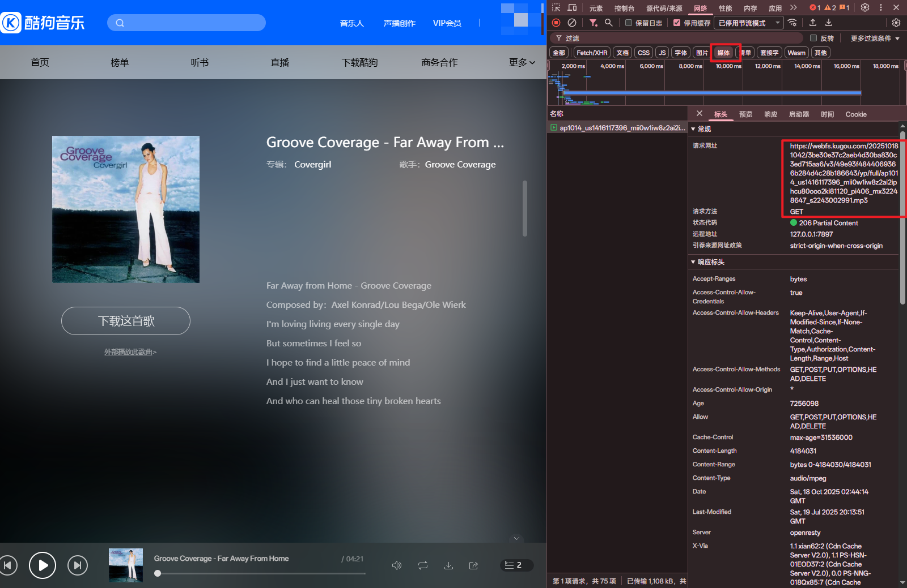
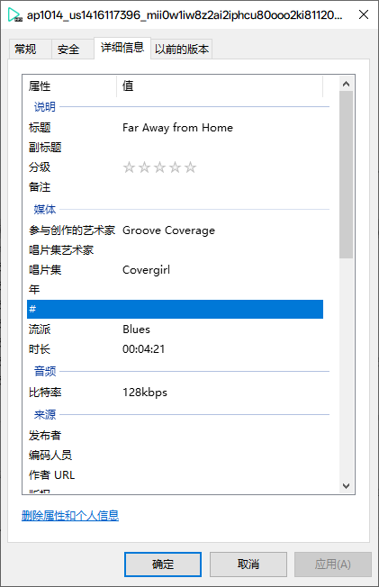
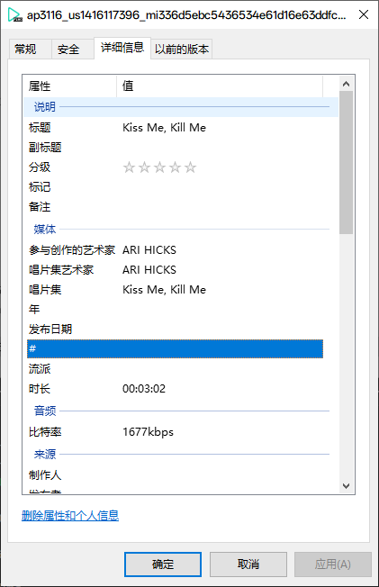
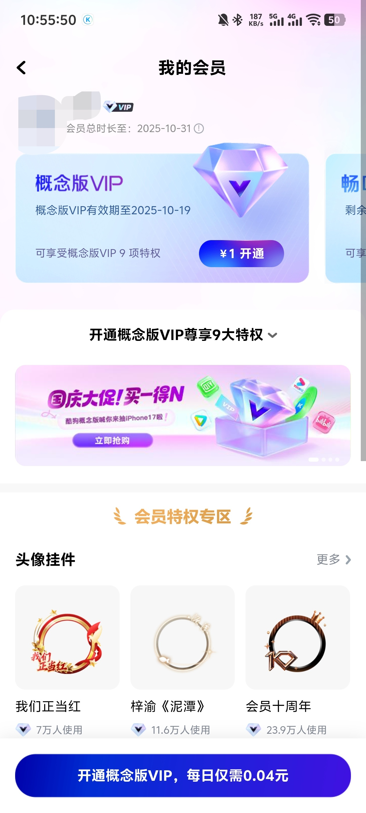

# 前言
:::caution[警告]
1. 本教程仅供学习交流，下载的音乐文件请于24小时内删除。  
2. 请务必尊重正版，从正常渠道获取音乐资源。
3. 造成的法律问题请自行承担责任。
:::

:::tip[提示]
教程中的酷狗主要指的是酷狗概念版，并非酷狗官方版。
:::

由于某些原因，我们有时需要下载一些歌曲。  
如果是**非VIP歌曲**（即无需开通会员即可听完整首歌、下载需要会员），可以直接去到 [酷狗音乐官网](https://www.kugou.com) 对应的歌曲页 ，从 Dev Tools 中获取**128kbps**、**.mp3**歌曲的链接： 

并且，从这个链接获取的是**音乐源文件**，也就是说包含了歌手等数据： 

**但是，对于一些VIP歌曲（即无会员时仅可试听）**，即使购买了会员，一般情况下，在酷狗概念版下载VIP歌曲获得的是类似 `xxx.kgm.flac` 格式的文件。**上锁了**。  
这种文件直接访问 https://legacy.um-react.app ，解锁一下音乐就好了。

这依然很麻烦。需要先将 `xxx.kgm.flac` 重命名为 `xxx.kgm` 后才能解锁，对于手机来说总体步骤比较麻烦，且
1. 一次性解锁一堆文件需要先传输到电脑再一并解锁。
2. 酷狗概念版没有 PC 端。
3. 畅听 VIP 无法下载 VIP 歌曲。参见 [#两种VIP的不同点](#两种vip的不同点) 。
3. 免费的酷狗概念版 VIP 从 API 获取最快。

# 用开源酷狗API解析音乐文件URL
## 后端
:::warning[注意]
1. 请不要信任陌生的后端 API 地址，以免造成数据泄露
2. 调用时要加上**&amp;和随机的字符**，以免后端缓存结果。
3. 需要将环境变量 `platform` 改为 `lite`（概念版）。参见 https://github.com/MakcRe/KuGouMusicApi#使用接口为概念版
:::

::github{repo="MakcRe/KuGouMusicApi"}

可将这个 NodeJS 版酷狗 API 的后端搭建在 [Vercel](https://vercel.com) 上调用（记得关注 Usage 使用情况）。也可以下载到本地安装依赖然后
```bash title="本地运行 API（Windows 命令提示符）"
npm install
set platform=lite
npm run dev
```

总之，搭建成功后的后端服务器的根目录应为： 

官方 API 文档： https://kugoumusicapi-docs.4everland.app/#/

接下来将以 `kugou.cl.nz` 作为演示，可以直接在浏览器输入。实际使用请替换为自己的。

## 第一步：登录
https://kugoumusicapi-docs.4everland.app/#/?id=登录  
https://kugoumusicapi-docs.4everland.app/#/?id=发送验证码

**手机号登录**（推荐）：
```bash title="登录/手机号验证"
# 发送验证码到 12345678910
https://kugou.cl.nz/captcha/sent?mobile=12345678910&qwertyuiop

#填入获得的验证码
https://kugou.cl.nz/login/cellphone?mobile=12345678910&code=114514&qwertyuiop 
```
成功后将会显示个人信息。

## 第二步：领取VIP
https://kugoumusicapi-docs.4everland.app/#/?id=领取-vip（需要登陆，该接口为测试接口仅限概念版使用

```bash title="领取概念版 VIP"
# 需要登录。领取概念版VIP，一次增加三小时，可重复获取8次，最大24h
https://kugou.cl.nz/youth/vip?qwertyuiop

领取完毕后为 {"error_msg":"今天次数已用光","data":"","status":0,"error_code":30002}
```

## 第三步：搜索音乐
https://kugoumusicapi-docs.4everland.app/#/?id=综合搜索

目的是为了获取音乐哈希值 `FileHash`。如果有 `FileHash` 的话可以直接前往 [#第四步：下载音乐](#第四步下载音乐)

```bash title="搜索音乐"
# 无需登录。无需取消缓存。返回 JSON。
# 可以搜歌词，也可以输入完整的音乐名，和在客户端搜索基本一致。一般大众音乐排在第一位。
# 以搜索歌词为例，源歌曲为 ARI HICKS - Kiss Me, Kill Me：So Tell Me What You're Waiting For
https://kugou.cl.nz/search/complex?keywords=So%20Tell%20Me%20What%20You%27re%20Waiting%20For
```

将会返回：

```json title="https://kugou.cl.nz/search/complex?keywords=So%20Tell%20Me%20What%20You%27re%20Waiting%20For" collapse={6-44, 47-79, 84-93, 96-105, 108-118, 127-177} {80, 81, 95, 156, 178}
{
  "data": {
    "correctiontip": "",
    "correctionforce": 0,
    "lists": [
      {
        "allowerr": 0,
        "isshareresult": 0,
        "sectag_info": {
          "is_sectag": 0
        },
        "istagresult": 0,
        "total": 42,
        "istag": 0,
        "lists": [
          {
            "SQFileHash": "243D9A6F6918879FAD2DAD37570B0FE3",
            "PublishTime": "",
            "Audioid": 83208546,
            "SuperDuration": 0,
            "OldCpy": 0,
            "PublishAge": 255,
            "HQBitrate": 320,
            "PayType": 3,
            "TagContent": "评论过万",
            "Accompany": 1,
            "SingerName": "ARI HICKS", // 歌手名
            "HQPrivilege": 10,
            "TopicRemark": "",
            "OriOtherName": "",
            "ShowingFlag": 0,
            "Source": "",
            "SQFileSize": 22060693,
            "AlbumAux": "",
            "HQDuration": 182,
            "Image": "http://imge.kugou.com/stdmusic/{size}/20221103/20221103054712785952.jpg",
            "HQPayType": 3,
            "HeatLevel": 5,
            "M4aSize": 0,
            "trans_param": {
              "ogg_128_hash": "A38E084A07325BCD0DD037F8145FA349",
              "classmap": {
                "attr0": 234881032
              },
              "language": "英语",
              "cpy_attr0": 58735744,
              "musicpack_advance": 1,
              "ogg_128_filesize": 2229498,
              "display_rate": 0,
              "union_cover": "http://imge.kugou.com/stdmusic/{size}/20221103/20221103054712785952.jpg",
              "qualitymap": {
                "attr0": 2134884468,
                "attr1": 136511488
              },
              "ogg_320_filesize": 8233880,
              "ogg_320_hash": "215E60CC931F0D02115735C082DCF590",
              "cid": 116911077,
              "cpy_grade": 5,
              "display": 0,
              "ipmap": {
                "attr0": 8606716928
              },
              "hash_offset": {
                "clip_hash": "9D099E09E3C7F057019305F0775A3ABA",
                "start_byte": 0,
                "end_ms": 60000,
                "end_byte": 960181,
                "file_type": 0,
                "start_ms": 0,
                "offset_hash": "87DB3C1A71394DD3D96BDF08E9477790"
              },
              "hash_multitrack": "8849F7DF7102CC5973C665C130EB2AED",
              "pay_block_tpl": 1,
              "cpy_level": 1
            },
            "SQPkgPrice": 1,
            "UploaderContent": "",
            "FoldType": 0,
            "FileSize": 2925136,
            "IsOriginal": 1, // 是否为原版，1为原版
            "FileHash": "0FD4158049ABCF692DA7E4D1C1AA963A", // 音乐哈希
            "Grp": [],
            "ID": "276107671",
            "isPrepublish": 0,
            "MvTrac": 3,
            "vvid": "",
            "Type": "audio",
            "Bitrate": 128,
            "SQPrice": 200,
            "ASQPrivilege": 10,
            "ExtName": "mp3",
            "PkgPrice": 1,
            "AlbumPrivilege": 10,
            "AlbumID": "39450255",
            "AlbumName": "Kiss Me, Kill Me",
            "Category": 1,
            "SuperExtName": "",
            "mvdata": [
              {
                "typ": 0,
                "trk": "3",
                "hash": "CAC0D33EE16A332FD8B2F8C3FB243856",
                "id": "10184904"
              }
            ],
            "OtherName": "",
            "SongName": "Kiss Me, Kill Me",
            "Res": {
              "PkgPrice": 1,
              "Privilege": 10,
              "PayType": 3,
              "Price": 200,
              "FailProcess": 4
            },
            "AudioCdn": 0,
            "SourceID": 0,
            "SQDuration": 182,
            "HQFileSize": 7312454,
            "MixSongID": "276107671",
            "Singers": [
              {
                "name": "ARI HICKS",
                "ip_id": 0,
                "id": 7279057
              }
            ],
            "SQPayType": 3,
            "SuperBitrate": 0,
            "MvHash": "CAC0D33EE16A332FD8B2F8C3FB243856",
            "HQPrice": 200,
            "Suffix": "",
            "HQFailProcess": 4,
            "HasAlbum": 1,
            "ResDuration": 182,
            "ResBitrate": 1670,
            "HiFiQuality": 3,
            "ResFileHash": "CD2CB994A5D61FABA86F258731CECF5E",
            "SingerId": [7279057],
            "HQExtName": "mp3",
            "SongLabel": "",
            "MatchFlag": 65536,
            "Scid": 83208546,
            "SuperFileHash": "",
            "QualityLevel": 3,
            "OriSongName": "Kiss Me, Kill Me", // 原始音乐名
            "MvType": 2,
            "mvTotal": 0,
            "SuperFileSize": 0,
            "FailProcess": 4,
            "SQExtName": "flac",
            "SQBitrate": 965,
            "RankId": 0,
            "PublishDate": "2020-10-30",
            "HQFileHash": "639FC7A5F9B7DA787D546B97BCA83BE6",
            "TopicUrl": "",
            "Auxiliary": "歌词 : So tell me what you're waiting for Don't you wanna be the one who stays alive A feeling that you can't ignore Me creeping up inside Oh why do I love a little bit of kiss me kill me cry Oh I oh I love a little bit of kiss me kill me die ", // 搜索中关键词的来源
            "TagDetails": [
              {
                "content": "评论过万", // 标识符
                "version": 1,
                "type": 5
              }
            ],
            "Privilege": 10,
            "PrepublishInfo": {
              "ReserveCount": 0,
              "DisplayTime": "",
              "Id": 0,
              "PublishTime": ""
            },
            "HQPkgPrice": 1,
            "OwnerCount": 93047,
            "Uploader": "",
            "Duration": 182,
            "SQFailProcess": 4,
            "TopID": 0,
            "A320Privilege": 10,
            "FileName": "ARI HICKS - Kiss Me, Kill Me", // 音乐文件名
            "ResFileSize": 38168107,
            "SQPrivilege": 10,
            "Price": 200,
            "recommend_type": 0,
            "Publish": 1
          },
          // 更多结果
```

可以看到，我们需要的 `FileHash` 为 `0FD4158049ABCF692DA7E4D1C1AA963A`。

## 第四步：下载音乐
https://kugoumusicapi-docs.4everland.app/#/?id=获取音乐-url

:::important[重要]
如果获取的是 VIP 歌曲，即未开通会员仅可试听的音乐，需要酷狗概念版VIP。参考 [#第二步：领取VIP](#第二步领取vip) 。  
强制获取需要概念版VIP的歌曲URL，将会提示 `{"errcode":20028,"status":0,"error":"本次请求需要验证"}`。
:::

下载音乐需要用到 [#第三步：搜索音乐](#第三步搜索音乐) 的 `FileHash` 和音质（可选，不指定将获取最低音质）。

**常用**的**部分**音质 `quality`：
`128`：128kbps `.mp3` 格式，**标准**
`320`：320kbps `.mp3` 格式，**高品**
`flac`：`.flac` 格式，**无损**，**无加密**
`high`：`.flac` 格式，**Hi-Res**，**无加密**

**注意：部分歌曲没有对应的高音质（如无 Hi-Res 的音乐依然请求 &quality=high），返回的音乐 URL 将为 128kbps 的 .mp3 音乐**

```bash title="下载音乐"
# hash 为第三步获取的 FileHash。不必取消缓存。
# hash=0FD4158049ABCF692DA7E4D1C1AA963A，quality=high（Hi-Res）
https://kugou.cl.nz/song/url?hash=0FD4158049ABCF692DA7E4D1C1AA963A&quality=high
```

将会返回：

```json title="https://kugou.cl.nz/song/url?hash=0FD4158049ABCF692DA7E4D1C1AA963A&quality=high" collapse={12-49, 51-54} {2, 10, 50, 56-57}
{
  "extName": "flac", // 音频文件的扩展名
  "classmap": {
    "attr0": 234881032
  },
  "status": 1,
  "volume": -8.4,
  "std_hash_time": 182778,
  "backupUrl": [
    "http://fs.youthandroid.kugou.com/202510181811/474420aee993e180059c8251e69abd37/v3/cd2cb994a5d61faba86f258731cecf5e/yp/full/ap3116_us1416117396_mi336d5ebc5436534e61d16e63ddfca327_pi411_mx0_quhigh_s3753791114.flac" // 最终音乐源文件
  ],
  "url": [
    "http://fs.youthandroid2.kugou.com/202510181811/08d7aef6a8e7368c33746fe52d707702/v3/cd2cb994a5d61faba86f258731cecf5e/yp/full/ap3116_us1416117396_mi336d5ebc5436534e61d16e63ddfca327_pi411_mx0_quhigh_s3753791114.flac",
    "http://fs.youthandroid.kugou.com/202510181811/474420aee993e180059c8251e69abd37/v3/cd2cb994a5d61faba86f258731cecf5e/yp/full/ap3116_us1416117396_mi336d5ebc5436534e61d16e63ddfca327_pi411_mx0_quhigh_s3753791114.flac"
  ],
  "std_hash": "0FD4158049ABCF692DA7E4D1C1AA963A",
  "tracker_through": {
    "identity_block": 0,
    "cpy_grade": 5,
    "musicpack_advance": 1,
    "all_quality_free": 0,
    "cpy_level": 1
  },
  "trans_param": {
    "display_rate": 0,
    "display": 0,
    "ogg_128_hash": "A38E084A07325BCD0DD037F8145FA349",
    "qualitymap": {
      "attr0": 2134884468,
      "attr1": 136511488
    },
    "pay_block_tpl": 1,
    "union_cover": "http://imge.kugou.com/stdmusic/{size}/20221103/20221103054712785952.jpg",
    "language": "英语",
    "hash_multitrack": "8849F7DF7102CC5973C665C130EB2AED",
    "cpy_attr0": 58735744,
    "ipmap": {
      "attr0": 8606716928
    },
    "ogg_320_hash": "215E60CC931F0D02115735C082DCF590",
    "classmap": {
      "attr0": 234881032
    },
    "ogg_128_filesize": 2229498,
    "ogg_320_filesize": 8233880
  },
  "fileHead": 100,
  "auth_through": [],
  "timeLength": 182,
  "bitRate": 1671000, // 音频文件比特率
  "priv_status": 1,
  "volume_peak": 0.1,
  "volume_gain": 0,
  "q": 0,
  "fileName": "002Y3LRz3yuT7N_000ifoEu1gY44L.flac", // 音乐文件名，出现这种需要以第三步中搜索的音乐中的 FileName 为准
  "fileSize": 38168107,
  "hash": "CD2CB994A5D61FABA86F258731CECF5E" // 此音频文件的哈希值
}
```

其中 `backupUrl` 中的
```bash title="ARI HICKS - Kiss Me, Kill Me.flac (Hi-Res)"
http://fs.youthandroid.kugou.com/202510181811/474420aee993e180059c8251e69abd37/v3/cd2cb994a5d61faba86f258731cecf5e/yp/full/ap3116_us1416117396_mi336d5ebc5436534e61d16e63ddfca327_pi411_mx0_quhigh_s3753791114.flac
```
即为我们需要的音频源文件。  
下载到的音频文件不是我们想要的，可以在 [#第三步：搜索音乐](#第三步搜索音乐) 中找到 `FileName`，再与第四步中 `extName` 结合即可。  
可以看到，下载下来的音频是有歌手名的源文件： 

# 两种VIP的不同点
酷狗概念版中有2种不同的VIP等级之分。分别是**概念版VIP**和**畅听VIP**。

|                 | 下载VIP歌曲 | 播放 Hi-Res 音质音乐 | 可通过签到获得 | 每次最大下载数 |
|-----------------|-------------|----------------------|----------------|----------------|
| 概念版 VIP      | ✔           | ✔                    | ❌              | 500            |
|     畅听 VIP    | ❌           | ❌                    | ✔              | -              |

